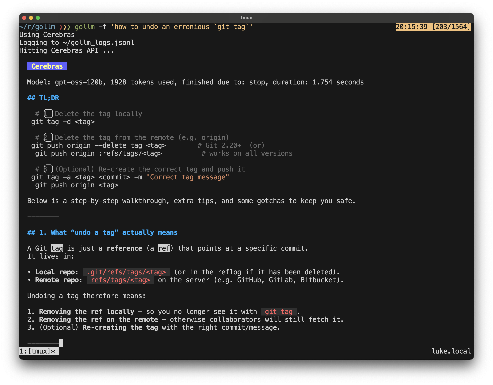

# gollm

## What is `gollm`?

gollm is a simple tool that connects your terminal to powerful AI models like OpenAI's ChatGPT, Google's Gemini, Anthropic's Claude, Perplexity, and Cerebras

## Why use `gollm`?

- Quick answers: Get fast responses to your questions or prompts
- Convenience: Interact with AI without leaving your terminal
- Scripting: Integrate AI capabilities into your shell workflows or scripts

## What does it look like



(Note that in the above screenshot `gollm` is aliased to `gollm -l`, hence logging is enabled)

## How to use

### Build locally

- Simply clone the repo and run `make build`; note that for this to work you will need a recent version of the Go programming language installed, see `go.mod` for required version
- Binaries for Mac, Windows and Linux will build in the `/bin` folder
- Note that the MacOS binaries are the ones labelled darwin and are available for both Apple Silicon (`gollm-darwin-arm64`) and Intel architectures (`gollm-darwin-amd64`)

### Download from Github

In the top right of the Github repo at <https://github.com/algrt-hm/gollm> you will be able to see `Releases`, like this:


which when clicked will take you to a page where you can download the binary. Alternatively you can use this link: <https://github.com/algrt-hm/gollm/releases>

## Functionality

Once you have obtained the binary for your operating system and architecture, you will most likely want to move or copy the binary name to `gollm` in a location specified within your `$PATH` variable.

You run the `gollm` command followed by your question or instruction. For example:

```sh
gollm "Please tell me a little about yourself"
```

The prompt will be sent to any LLMs you have API keys set up for and the responses will be printed as they come back.

Or you can send text from another command to gollm:

```sh
cat my_document.txt | gollm "Summarize this text"
```

By way of a more advanced example:

```sh
(printf "Please generate a commit message based on this diff\n\n---\n\n"; git status -v) | gollm -q -c
```

(Note: You'll need to set it up first, which involves getting API keys from the AI providers.)

If you only want to use one model, you can specify that with flags ...

## Usage

```
gollm [options] [model]

options:
-h	show (this) help
-i	interactive chat mode (requires single model, defaults to Claude)
-lg	list Gemini models
-lc	list OpenAI models
-la	list Anthropic models
-t	test API keys (note: they will be displayed)
-l	enable logging of model interactions to ~/gollm_logs.jsonl
-q	quiet mode: turns off logging and all non-essential output
-rl	[index]	show the log index, or if an index is provided, show the LLM response

model:
-c	use ChatGPT
-g	use Gemini
-f	use Cerebras
-p	use Perplexity
-s	use Claude (Sonnet)

API keys should be set using the environment variables below:

# For Perplexity
export PERPLEXITY_API_KEY="your Perplexity API key here"

# For ChatGPT
export OPENAI_API_KEY="your OpenAI API key here"

# For Gemini
export GEMINI_API_KEY="your Gemini API key here"

# For Cerebras
export CEREBRAS_API_KEY="your Cerebras API key here"

# For Claude
export ANTHROPIC_API_KEY="your Anthropic API key here"

Setup:
- You already have PERPLEXITY_API_KEY set
- You already have OPENAI_API_KEY set
- You already have GEMINI_API_KEY set
- You already have CEREBRAS_API_KEY set
- You already have ANTHROPIC_API_KEY set
- You are connected to the internet
- We're ready to rumble :)

Default models:
- Perplexity: sonar-pro
- ChatGPT: gpt-5.2
- Gemini: models/gemini-3-pro-preview
- Cerebras: zai-glm-4.7
- Claude: claude-sonnet-4-5-20250929
```

## Interactive Mode

Use the `-i` flag for multi-turn conversations with a single model:

- `gollm -i` - Interactive chat with Claude (default)
- `gollm -i -c` - Interactive chat with ChatGPT
- `gollm -i -g` - Interactive chat with Gemini
- `gollm -i -f` - Interactive chat with Cerebras
- `gollm -i -p` - Interactive chat with Perplexity

In interactive mode, type your message and press Enter. The model remembers the conversation history. Type `exit` or `quit` to end the session, or press Ctrl+C to exit immediately.

Note: Interactive mode requires a single model and disables logging.

## Logging

When you use the `-l` flag, gollm will log all model interactions to a file called `gollm_logs.jsonl` in your home directory. Each log entry contains:

- Model name
- Total tokens used
- Duration of the request
- Stop reason
- Prompt text
- Model response
- Timestamp

This can be useful for: tracking your API usage, analysing model performance etc.

The logs are stored in JSONL format (one JSON object per line), making them easy to process with tools like `jq` or import into data analysis tools. SQLite would have been another option but this would make cross-compilation more difficult.

## More bits

**Go**

For installation of latest go on Ubuntu see: https://algrt.hm/2024-09-29-recent-go-on-popos/

**Gemini**

- For GEMINI_API_KEY see: https://aistudio.google.com/app/plan_information
- For usage of the API see: https://console.cloud.google.com/apis/api/generativelanguage.googleapis.com/metrics

## FAQs

*How do I set environment variables in Windows?*

To make environment variables persist across sessions:

1. Open System Properties:
	* Press <kbd>Win</kbd> + <kbd>R</kbd>, type `sysdm.cpl`, and press Enter.
	* Go to the Advanced tab.
	* Click on Environment Variables...
2. Add/Edit Variables:
	* Under "User variables" (for your account) or "System variables" (for all users), click New..., enter a name and value, then click OK.
	* To edit an existing variable, select it and click Edit...
3. Apply Changes:
	* Click OK on all dialogs to apply changes.
