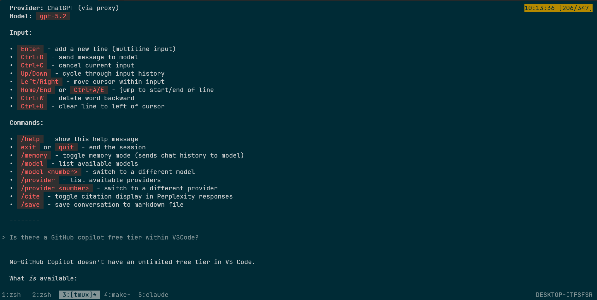

# gollm

## What is `gollm`?

gollm is a simple tool that connects your terminal to powerful AI models like OpenAI's ChatGPT, Google's Gemini, Anthropic's Claude, Perplexity, Cerebras, and DeepSeek

## Why use `gollm`?

- Quick answers: Get fast responses to your questions or prompts
- Convenience: Interact with AI without leaving your terminal
- Scripting: Integrate AI capabilities into your shell workflows or scripts

## Interactive functionality

Use the `-i` flag for multi-turn conversations with a single model:

- `gollm -i` - Interactive chat (auto-selects provider: Cerebras > Claude > ChatGPT > Gemini > Perplexity > DeepSeek)
- `gollm -i -c` - Interactive chat with ChatGPT
- `gollm -i -g` - Interactive chat with Gemini
- `gollm -i -f` - Interactive chat with Cerebras
- `gollm -i -s` - Interactive chat with Claude
- `gollm -i -p` - Interactive chat with Perplexity
- `gollm -i -d` - Interactive chat with DeepSeek
- `gollm -i -x -c` - Interactive chat with ChatGPT, bypassing LLM Proxy



### Input

Interactive mode supports multiline input with history and line editing:

| Key | Action |
|-----|--------|
| `Enter` | Add a new line (continue typing), or submit if input is a command |
| `Ctrl+D` | Send message to model |
| `Ctrl+C` | Cancel current input |
| `Up` / `Down` | Cycle through input history |
| `Left` / `Right` | Move cursor within input |
| `Home` / `End` | Jump to start/end of current line |
| `Ctrl+A` / `Ctrl+E` | Jump to start/end of current line |
| `Ctrl+W` | Delete word backward |
| `Ctrl+U` | Clear from cursor to start of line |
| `Delete` | Delete character at cursor |

Note: Commands (`exit`, `quit`, `/help`, etc.) submit immediately on Enter.

**Troubleshooting:** If your terminal appears corrupted after exiting (garbled text, no echo), run `reset` or `stty sane` to restore it.

### Interactive commands

Once in interactive mode, you can use these commands:

| Command | Description |
|---------|-------------|
| `/help` | Show available commands |
| `exit`, `quit`, or `/exit` | End the session |
| `/memory` | Toggle memory mode (when enabled, chat history is sent to the model) |
| `/model` | List available models for current provider |
| `/model <number>` | Switch to a different model (e.g., `/model 2`) |
| `/provider` | List available providers (shows which have API keys configured) |
| `/provider <number>` | Switch to a different provider (e.g., `/provider 3`) |
| `/cite` | Toggle citation display in Perplexity responses (on by default) |
| `/save` | Save conversation to a markdown file (prompts for filename) |

Note: Interactive mode requires a single model and disables logging. A spinner is shown while waiting for model responses.

## Building / downloading

### Build locally

- Simply clone the repo and run `make build`; note that for this to work you will need a recent version of the Go programming language installed, see `go.mod` for required version

### Download from Github

In the top right of the Github repo at <https://github.com/algrt-hm/gollm> you will be able to see `Releases`, like this:


which when clicked will take you to a page where you can download the binary. Alternatively you can use this link: <https://github.com/algrt-hm/gollm/releases>

#### `$PATH`

Once you have obtained the binary for your operating system and architecture, you will most likely want to move or copy the binary name to `gollm` in a location specified within your `$PATH` variable.

## Non-interactive usage

You run the `gollm` command followed by your question or instruction. For example:

```sh
gollm "Please tell me a little about yourself"
```

The prompt will be sent to any LLMs you have API keys set up for and the responses will be printed as they come back.

Or you can send text from another command to gollm:

```sh
cat my_document.txt | gollm "Summarize this text"
```

By way of a more advanced example:

```sh
(printf "Please generate a commit message based on this diff\n\n---\n\n"; git status -v) | gollm -q -c
```

(Note: You'll need to set it up first, which involves getting API keys from the AI providers.)

If you only want to use one model, you can specify that with flags ...

I use an expanded version of the above to auto-generate git commit messages which I then copy and paste:

```bash
f-commit-pls () {
        (
                printf "Please generate a commit message based on this diff. The format should be a single sentence followed by more detail in bullet points. Please do not use markdown apart from bullet points. Please do not use any formatting except backticks and bullet points which are fine. The end of a bullet point should not have a full-stop (period) at the end. The end of the title of the commit should not have a full-stop (period) at the end.\n\n---\n\n"
                git status -v
        ) | gollm -l -q -c
}
```

## Usage

```
gollm [options] [model]

options:
-h	show (this) help
-i	interactive chat mode (requires single model, auto-selects first available)
-x	bypass LLM Proxy (proxy is used automatically when LLM_PROXY_URL is set)
-lg	list Gemini models
-lc	list OpenAI models
-la	list Anthropic models
-t	test API keys (note: they will be displayed)
-l	enable logging (disabled automatically when routing through LLM Proxy)
	logs model interactions to ~/gollm_logs.jsonl
-q	quiet mode: turns off logging and all non-essential output
-rl	[index]	show the log index, or if an index is provided, show the LLM response

model:
-c	use ChatGPT
-g	use Gemini
-f	use Cerebras
-p	use Perplexity
-s	use Claude (Sonnet)
-d	use DeepSeek

API keys should be set using the environment variables below:

# For Perplexity
export PERPLEXITY_API_KEY="your Perplexity API key here"

# For ChatGPT
export OPENAI_API_KEY="your OpenAI API key here"

# For Gemini
export GEMINI_API_KEY="your Gemini API key here"

# For Cerebras
export CEREBRAS_API_KEY="your Cerebras API key here"

# For Claude
export ANTHROPIC_API_KEY="your Anthropic API key here"

# For DeepSeek
export DEEPSEEK_API_KEY="your DeepSeek API key here"

# For LLM Proxy (proxy enabled automatically when set, -x to bypass)
export LLM_PROXY_URL="http://localhost:8000/v1"

Setup:
- You already have PERPLEXITY_API_KEY set
- You already have OPENAI_API_KEY set
- You already have GEMINI_API_KEY set
- You already have CEREBRAS_API_KEY set
- You already have ANTHROPIC_API_KEY set
- You already have DEEPSEEK_API_KEY set
- You already have LLM_PROXY_URL set
- You are connected to the internet
- We're ready to rumble :)

Default models:
- Perplexity: sonar-pro
- ChatGPT: gpt-5.4
- Gemini: models/gemini-3.1-pro-preview
- Cerebras: gpt-oss-120b
- Claude: claude-sonnet-4-6
- DeepSeek: deepseek-v4-pro
```

## Logging

When you use the `-l` flag, gollm will log all model interactions to a file called `gollm_logs.jsonl` in your home directory. Each log entry contains:

- Model name
- Total tokens used
- Duration of the request
- Stop reason
- Prompt text
- Model response
- Timestamp

Logging is automatically disabled when requests are routed through LLM Proxy. If the proxy is unreachable (or bypassed with `-x`), logging remains active.

This can be useful for: tracking your API usage, analysing model performance etc.

The logs are stored in JSONL format (one JSON object per line), making them easy to process with tools like `jq` or import into data analysis tools. SQLite would have been another option but this would make cross-compilation more difficult.

## More bits

**Go**

For installation of latest go on Ubuntu see: https://algrt.hm/2024-09-29-recent-go-on-popos/

**Gemini**

- For GEMINI_API_KEY see: https://aistudio.google.com/app/plan_information
- For usage of the API see: https://console.cloud.google.com/apis/api/generativelanguage.googleapis.com/metrics

## FAQs

*How do I set environment variables in Windows?*

To make environment variables persist across sessions:

1. Open System Properties:
	* Press <kbd>Win</kbd> + <kbd>R</kbd>, type `sysdm.cpl`, and press Enter.
	* Go to the Advanced tab.
	* Click on Environment Variables...
2. Add/Edit Variables:
	* Under "User variables" (for your account) or "System variables" (for all users), click New..., enter a name and value, then click OK.
	* To edit an existing variable, select it and click Edit...
3. Apply Changes:
	* Click OK on all dialogs to apply changes.
